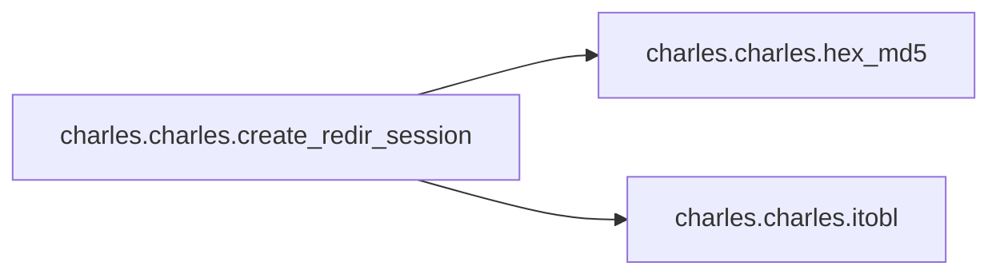

# Charles Charles

[_Documentation generated by Documatic_](https://www.documatic.com)

<!---Documatic-section-Codebase Structure-start--->
## Codebase Structure

<!---Documatic-block-system_architecture-start--->
```mermaid
None
```
<!---Documatic-block-system_architecture-end--->

# #
<!---Documatic-section-Codebase Structure-end--->

<!---Documatic-section-charles.charles.hex_md5-start--->
## [charles.charles.hex_md5](3-charles_charles.md#charles.charles.hex_md5)

<!---Documatic-section-hex_md5-start--->
<!---Documatic-block-charles.charles.hex_md5-start--->
<details>
	<summary><code>charles.charles.hex_md5</code> code snippet</summary>

```python
def hex_md5(data):
    return hashlib.md5(data.encode('utf-8')).hexdigest()
```
</details>
<!---Documatic-block-charles.charles.hex_md5-end--->
<!---Documatic-section-hex_md5-end--->

# #
<!---Documatic-section-charles.charles.hex_md5-end--->

<!---Documatic-section-charles.charles.itobl-start--->
## [charles.charles.itobl](3-charles_charles.md#charles.charles.itobl)

<!---Documatic-section-itobl-start--->
<!---Documatic-block-charles.charles.itobl-start--->
<details>
	<summary><code>charles.charles.itobl</code> code snippet</summary>

```python
def itobl(i, c=1):
    return i.to_bytes(c, 'little')
```
</details>
<!---Documatic-block-charles.charles.itobl-end--->
<!---Documatic-section-itobl-end--->

# #
<!---Documatic-section-charles.charles.itobl-end--->

<!---Documatic-section-charles.charles.itobb-start--->
## [charles.charles.itobb](3-charles_charles.md#charles.charles.itobb)

<!---Documatic-section-itobb-start--->
<!---Documatic-block-charles.charles.itobb-start--->
<details>
	<summary><code>charles.charles.itobb</code> code snippet</summary>

```python
def itobb(i, c=1):
    return i.to_bytes(c, 'big')
```
</details>
<!---Documatic-block-charles.charles.itobb-end--->
<!---Documatic-section-itobb-end--->

# #
<!---Documatic-section-charles.charles.itobb-end--->

<!---Documatic-section-charles.charles.btobl-start--->
## [charles.charles.btobl](3-charles_charles.md#charles.charles.btobl)

<!---Documatic-section-btobl-start--->
<!---Documatic-block-charles.charles.btobl-start--->
<details>
	<summary><code>charles.charles.btobl</code> code snippet</summary>

```python
def btobl(i, c=1):
    return i + b'\x00' * (c - len(i))
```
</details>
<!---Documatic-block-charles.charles.btobl-end--->
<!---Documatic-section-btobl-end--->

# #
<!---Documatic-section-charles.charles.btobl-end--->

<!---Documatic-section-charles.charles.create_redir_session-start--->
## [charles.charles.create_redir_session](3-charles_charles.md#charles.charles.create_redir_session)

<!---Documatic-section-create_redir_session-start--->


### Object Calls

* [charles.charles.hex_md5](3-charles_charles.md#charles.charles.hex_md5)
* [charles.charles.itobl](3-charles_charles.md#charles.charles.itobl)

<!---Documatic-block-charles.charles.create_redir_session-start--->
<details>
	<summary><code>charles.charles.create_redir_session</code> code snippet</summary>

```python
def create_redir_session(hostname, port, username, password, service):
    sock = socket.socket(socket.AF_INET, socket.SOCK_STREAM)
    sock.setblocking(True)
    sock.connect((hostname, int(port)))

    def send(data):
        sock.sendall(data)

    def recv(count=1024):
        return sock.recv(count)
    send(b'\x10\x00\x00\x00' + service.encode())
    time.sleep(0.005)
    rv = recv()
    if chr(rv[0]) != '\x11':
        raise Exception('auth', 'did not receive StartRedirectionSessionReply code')
    if chr(rv[1]) != '\x00':
        raise Exception('auth', 'StartRedirectionSessionReply returned non-zero status code')
    send(b'\x13\x00\x00\x00\x00\x00\x00\x00\x00')
    rv = recv()
    if chr(rv[0]) != '\x14':
        raise Exception('auth', 'did not receive AuthenticateSessionReply code')
    auth_type = chr(rv[4])
    status = chr(rv[1])
    if auth_type != '\x00' or status != '\x00':
        raise Exception('auth', 'unhandled authentication protocol in AuthenticateSessionReply')
    auth_target = b'/RedirectionService'
    data = b'\x13\x00\x00\x00\x04 \x00\x00\x00' + bytes([len(username)]) + username.encode() + b'\x00\x00'
    data += itobl(len(auth_target)) + auth_target + b'\x00\x00\x00\x00'
    send(data)
    rv = recv()
    realm_len = int(rv[9])
    realm = rv[10:10 + realm_len]
    nonce_len = int(rv[10 + realm_len])
    nonce = rv[11 + realm_len:11 + realm_len + nonce_len]
    cnonce = ''.join(random.choices(string.ascii_lowercase + string.digits, k=32))
    p1 = username + ':' + realm.decode() + ':' + password
    p2 = nonce.decode() + ':' + '00000002' + ':' + cnonce + ':' + 'auth'
    p3 = 'POST' + ':' + auth_target.decode()
    cr = hex_md5(hex_md5(p1) + ':' + p2 + ':' + hex_md5(p3))
    print('Challenge answer is: ' + cr)
    auth_data = itobl(len(username)) + username.encode()
    auth_data += itobl(realm_len) + realm
    auth_data += itobl(nonce_len) + nonce
    auth_data += itobl(len(auth_target)) + auth_target
    auth_data += itobl(len(cnonce)) + cnonce.encode()
    auth_data += b'\x08' + b'00000002'
    auth_data += itobl(len(cr)) + cr.encode()
    auth_data += b'\x04' + b'auth'
    data = b'\x13\x00\x00\x00\x04'
    data += itobl(len(auth_data), 4)
    data += auth_data
    send(data)
    rv = recv()
    if rv != b'\x14\x00\x00\x00\x04\x00\x00\x00\x00':
        print('authentication failed, check creds')
        return
    return sock
```
</details>
<!---Documatic-block-charles.charles.create_redir_session-end--->
<!---Documatic-section-create_redir_session-end--->

# #
<!---Documatic-section-charles.charles.create_redir_session-end--->

[_Documentation generated by Documatic_](https://www.documatic.com)